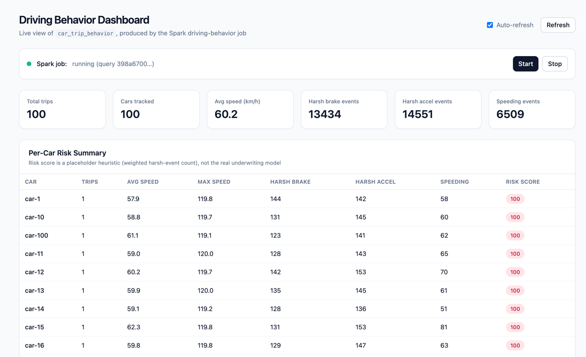

# 🚗 Connected Car Platform

> A production-style, event-driven Connected Car (Telematics) platform built with **Spring Boot, Apache Kafka, Kafka Streams, Apache Spark Structured Streaming, Cassandra, Next.js, Docker, and Kubernetes**.


---

# 📌 Overview

Modern connected vehicles generate thousands of telemetry events every minute, including:

* GPS Location
* Vehicle Speed
* RPM
* Fuel Level
* Engine Temperature
* Acceleration
* Brake Events
* G-Force
* Battery Status

This project demonstrates how to build a **real-time telematics platform** capable of ingesting, processing, analyzing, and visualizing millions of streaming events using an event-driven microservices architecture.

The platform combines **Kafka Streams** for low-latency event processing with **Apache Spark Structured Streaming** for large-scale analytics.

---

# 🎯 Objectives

* Build a production-style IoT streaming platform.
* Demonstrate modern Event-Driven Architecture.
* Showcase Java backend engineering best practices.
* Process streaming vehicle telemetry.
* Calculate driver behavior and driving scores.
* Build REST APIs and real-time dashboards.
* Deploy using Docker and Kubernetes.
* Implement observability and monitoring.

---

# 🏗 High-Level Architecture

```text
Vehicle Simulator
        │
        ▼
Telemetry Gateway (Spring Boot WebFlux)
        │
        ▼
Apache Kafka
        │
        ▼
Kafka Streams
        │
 ┌──────┴─────────┐
 ▼                ▼
Alerts      Cleaned Events
 │                │
 ▼                ▼
Notification   Apache Spark
                    │
         ┌──────────┴─────────┐
         ▼                    ▼
    Cassandra             MinIO/S3
         │
         ▼
Dashboard API
         │
         ▼
Next.js Dashboard
```

---

# 🚀 Technology Stack

## Backend

* Java 21
* Spring Boot 3.5.x
* Spring WebFlux
* Spring Kafka
* Kafka Streams
* Spring Data Cassandra
* Micrometer
* OpenAPI (Swagger)

## Streaming

* Apache Kafka (KRaft)
* Kafka Streams
* Apache Spark Structured Streaming

## Database

* Apache Cassandra

## Object Storage

* MinIO (S3 Compatible)

## Frontend

* Next.js 15
* React
* TypeScript
* Tailwind CSS
* Shadcn UI
* Recharts
* Google Maps / Leaflet

## Infrastructure

* Docker
* Docker Compose
* Kubernetes
* Helm

## Monitoring

* Prometheus
* Grafana
* Loki
* Tempo
* OpenTelemetry

## CI/CD

* GitHub Actions
* Jenkins

---

# 📁 Project Structure

```text
connected-car-platform/
│
├── infra/
│   ├── kafka/
│   ├── cassandra/
│   ├── spark/
│   ├── minio/
│   ├── monitoring/
│   └── docker-compose.yml
│
├── services/
│   ├── common-lib/
│   ├── telemetry-gateway/
│   ├── kafka-streams-service/
│   ├── driver-service/
│   ├── trip-service/
│   ├── notification-service/
│   ├── analytics-api/
│   └── dashboard-api/
│
├── simulator/
│   └── vehicle-simulator/
│
├── analytics/
│   └── spark-streaming/
│
├── frontend/
│   └── connected-dashboard/
│
├── docs/
├── scripts/
├── k8s/
├── helm/
├── pom.xml
└── README.md
```

---

# 🚘 Features

### Vehicle Simulator

* Generates configurable telemetry
* Simulates thousands of vehicles
* Configurable event rate
* Random GPS coordinates
* Random speed and fuel
* Crash simulation

### Telemetry Gateway

* REST API
* Request validation
* Kafka Producer
* Reactive APIs
* Logging
* Exception handling

### Kafka Streams

* GPS validation
* Duplicate filtering
* Speed violation detection
* Crash detection
* Fuel warning
* Driver score calculation

### Spark Streaming

* Window aggregation
* Average speed
* Trip distance
* Driving score
* Historical analytics

### Dashboard

* Live vehicles
* Driver statistics
* Trip history
* Maps
* Alerts
* Charts

---

# 📡 Event Flow

```text
Vehicle

↓

Telemetry Generator

↓

Gateway

↓

Kafka

↓

Kafka Streams

↓

Spark Streaming

↓

Cassandra

↓

Dashboard API

↓

Next.js Dashboard
```

---

# 📊 Kafka Topics

| Topic             | Description           |
| ----------------- | --------------------- |
| telemetry.raw     | Raw vehicle telemetry |
| telemetry.cleaned | Valid telemetry       |
| speed.alert       | Overspeed alerts      |
| crash.alert       | Crash events          |
| fuel.alert        | Low fuel alerts       |
| driver.score      | Driver score updates  |
| trip.started      | Trip started          |
| trip.completed    | Trip completed        |

---

# 🗄 Cassandra Tables

* driver
* vehicle
* trip
* telemetry_summary
* driver_score
* alerts

---

# 🌐 REST APIs

## Gateway

```
POST /telemetry
```

## Driver Service

```
GET /drivers
GET /driver/{id}
GET /driver/{id}/score
GET /driver/{id}/trips
```

## Dashboard

```
GET /dashboard
GET /dashboard/live
GET /dashboard/alerts
```

---

# 📈 Monitoring

* JVM Metrics
* Kafka Metrics
* Consumer Lag
* Cassandra Metrics
* Spark Metrics
* HTTP Metrics
* Docker Metrics
* Kubernetes Metrics

---

# 🐳 Running Locally

## Clone

```bash
git clone https://github.com/yourusername/connected-car-platform.git
cd connected-car-platform
```

## Start Infrastructure

```bash
docker compose -f infra/docker-compose.yml up -d
```

## Build

```bash
mvn clean install
```

## Start Services

```bash
./scripts/start.sh
```

---

# 🧪 Load Testing

Using k6

```bash
k6 run load-test.js
```

Supported Scenarios

* 100 TPS
* 1,000 TPS
* 5,000 TPS
* 10,000 TPS

---

# 📚 Documentation

* Architecture
* API Documentation
* Kafka Topics
* Database Design
* Deployment Guide
* Kubernetes Guide
* Helm Guide

---

# 🛣 Roadmap

* [x] Project Structure
* [x] Docker Infrastructure
* [ ] Common Library
* [ ] Vehicle Simulator
* [ ] Gateway Service
* [ ] Kafka Streams
* [ ] Spark Streaming
* [ ] Cassandra Integration
* [ ] Dashboard API
* [ ] Next.js Dashboard
* [ ] Monitoring
* [ ] Kubernetes
* [ ] Helm
* [ ] GitHub Actions
* [ ] Jenkins Pipeline
* [ ] Performance Testing
* [ ] Production Hardening

---

# 🤝 Contributing

Contributions are welcome.

1. Fork the repository.
2. Create a feature branch.
3. Commit your changes.
4. Open a Pull Request.

---

# 📄 License

Licensed under the Apache License 2.0.

---

# 👨‍💻 Author

**Malleswar**

Senior Java Backend Engineer

Specializing in:

* Spring Boot
* Kafka
* Kafka Streams
* Distributed Systems
* Event-Driven Architecture
* Microservices
* Apache Spark
* Cloud-Native Applications

---

## ⭐ If you find this project useful, consider giving it a Star on GitHub!


# Driving Behavior Dashboard



